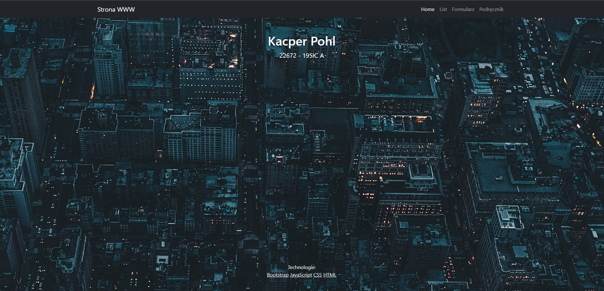
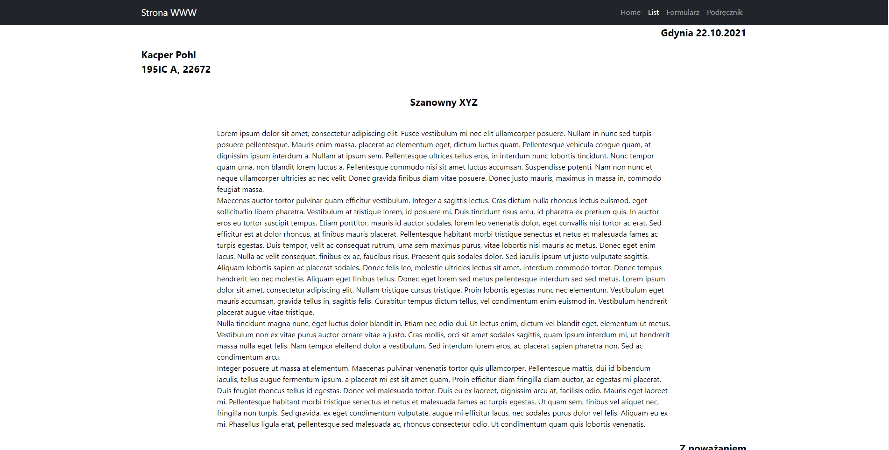
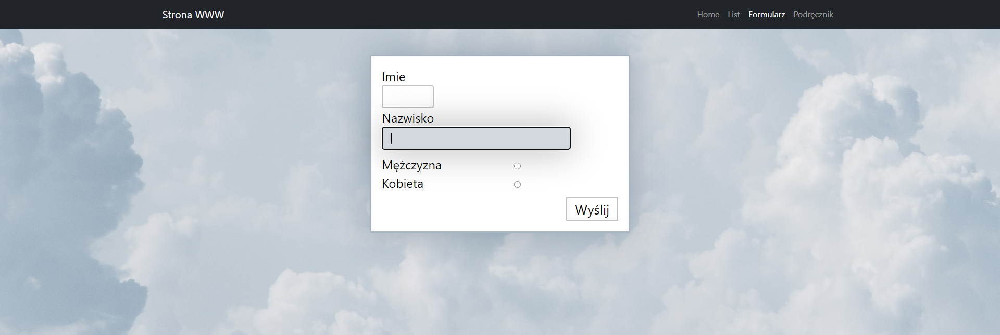
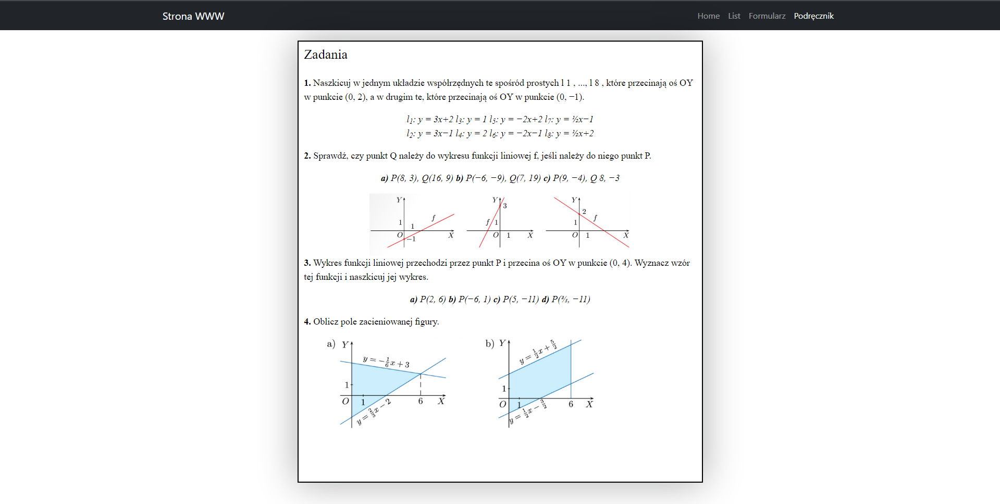

# Lab nr. 1

### Strona startowa - Home (intex.html)

Prosta strona z imieniem i nazwiskiem autora, oraz z jakie technologie zostały wykorzystane na stronie.
Do każdej z technologi jest podpięty link, który może nakierować zainteresowaną osobę.
Strona jest podzielona tylko na dwa div'y, jeden do autora, druga do technologii.

### List (list.html)

Strona sformatowana w taki sposób, żeby wyglądała jak list. W tym przypadku wykrzystano kilka div'ów do odpowiedniego
rozłożenia tekstu na stronie.

### Formularz (formularz.html)

Strona sformatowana na styl formularza. Są dwa input box'y, do wprowadzenia imienia i nazwiska, 
dwa radio button'y do określenia płci i button do wysłania formularza. Input box'y, radio button'y i submit button, 
są w osobnych div'ach, gdzie i tak to wszystko znajduje się w jeszcze jednym div'ie, w celu stworzenia boxa z obrabówką.
Dużo zastosowano CSS, w celu zmiany wyglądu input box'ów, co daje bardzo fajny efekt bo najechaniu, jak i wciśnieciu pola.

### Podręcznik (podrecznik.html)

Strona która przypomina wyglądem stronę z podręcznika. Do całej strony zastosowano jeden div, 
a w samej stronie zastosowano paragrafy do odpowiedniego rozłożenia treści. Jedynie w przypadku zadania nr. 2 trzeba
było wykorzystać dodatkowo div, w celu odpowiedniego sformatowania obrazków z figurami do treści zadania.

