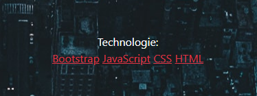
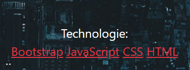
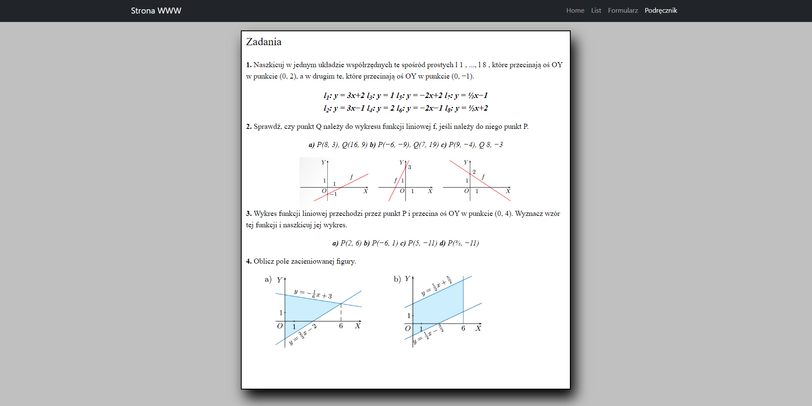

# Lab nr. 2

### Strona startowa - Home (intex.html)

Dodałem na środku wyświetlanie aktualnej godziny, oraz guzik do zmiany tła. Można zmieniać pomiędzy jasnym oraz ciemnym, przy czym zmienia się także kolor czcionki żeby był czytelny. 
Przy odpaleniu strony włącza się funkcja startTime która jest przypisana do body. 
Sama funkcja pobiera aktualną godzinę, minutę i sekundy. Na końcu jest setTimeout do odświeżenia i ponowne włączenie funkcji do zczytania czasu.
Guzik jest stworzony w pliku index.js oraz funkcja któa odpowiada za zmianę tła oraz koloru textu.
Dodatkowo przy najechaniu na technologie, tekst powiększa się, a po zabraniu myszki z tekstu, wraca do normalnego rozmiaru.

### List (list.html)

Dodałem dwa guziki dające możliwość powiększenia lub zmniejszenia tekstu listu. Guziki to pliki png, które po kliknięciu wywołują funkcję odpowiadającą za zmianę rozmiaru czcionki.
Sama funkcja zczytuje mnożnik, gdzie przy plusie równa się 1, a przy minusie -1, mnoży go o 0.2 i dodaje do obecnej wielkości czcionki. Rozmiar jest w em.
Dodałem także trzy guziki od modyfikacji tekstu oraz tła. Mamy guzik od zmiany czcionki. Guzik który odpowiada do zmiany tła z jasnego na ciemne i na odwrót, a także guzik od pogrubienia tekstu listu.
Wszystkie guziki stworzone są w list.js. Dodatkowo data listu jest zawsze aktualna. Data jest zczytywany w list.js, a następnie wrzucana do paragrafu od daty.

### Formularz (formularz.html)

Teraz strona sprawdza czy wszystkie inputy są uzupełnione. Jeśli nie uzupełnimy wszystkie, wyskoczy nam komunikat o tym że mamy wszystko uzupełnić.
Gdy wszystko uzupełnimy i wyślemy, dostaniemy podziękowania za uzupełnienie formularza. Po przejechaniu wskażnikiem na guziku wyślij, zmieni się kolor jego tła na losowy.
Tak samo po najechaniu na okienko formularza, jego cień i ramka zmieni kolor na żółty, a gdy wyjdziemy wskaźnikiem z okienka, wróci do poprzedniego koloru.
W zależności od tego jaką płeć zaznaczymy, kolor tła okienka zmieni się. Jeśli mężczyzna to na niebieski, jeśli kobieta to różowy.

### Podręcznik (podrecznik.html)

Na samej stronie zmieniłem trochę wygląd za pomocą js. Stworzyłem cień przy stronie, zmieniłem kolor tła za stroną, zmodyfikowałem ramkę.
Dodałem możliwość powiększenia obrazka po naciśnieciu. Domyślnie strona podręcznika jest zaokrąglona, jeśli jednak najedziemy na strone to okienko będzie kanciasta.
Tak samo jak najedziemy na równania pod treścią zadania, to czcionka się powiększy i zrobi się grubsza. Gdy zabierzemy mysz, to wróci do normalnego rozmiaru.

