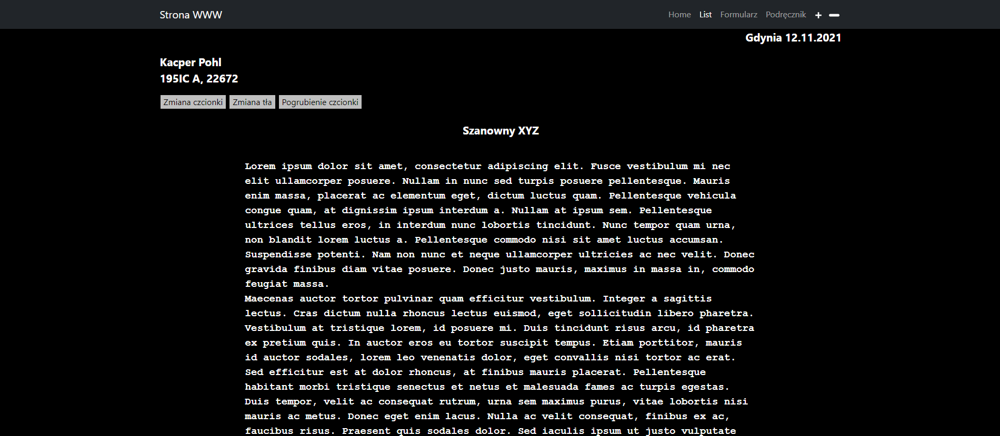
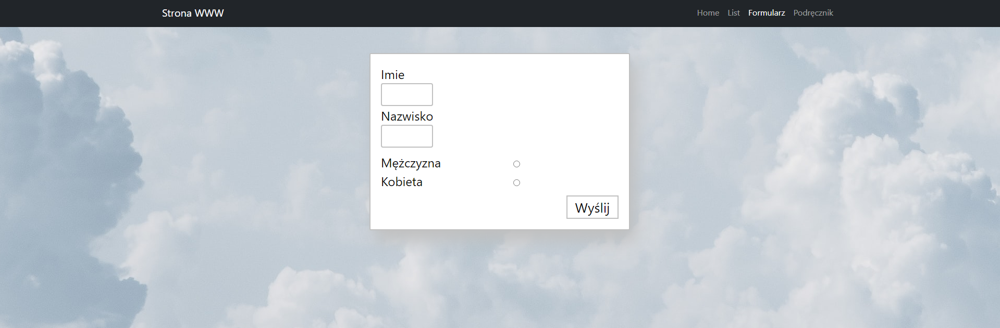

# Lab nr. 2

### Strona startowa - Home (intex.html)

Dodałem na środku wyświetlanie aktualnej godziny, oraz guzik do zmiany tła na jasne. Przy odpaleniu strony włącza się funkcja
startTime która jest przypisana do body. Sama funkcja pobiera aktualną godzinę, minutę i sekundy. Na końcu jest setTimeout do odświeżenia i ponowne włączenie funkcji do zczytania czasu.
Guzik jest stworzony w pliku index.js oraz funkcja któa odpowiada za zmianę tła oraz koloru textu.

### List (list.html)

Dodałem dwa guziki dające możliwość powiększenia lub zmniejszenia tekstu listu. Guziki to pliki png, które po kliknięciu wywołują funkcję odpowiadającą za zmianę rozmiaru czcionki.
Sama funkcja zczytuje mnożnik, gdzie przy plusie równa się 1, a przy minusie -1, mnoży go o 0.2 i dodaje do obecnej wielkości czcionki. Rozmiar jest w em.

### Formularz (formularz.html)

Teraz strona sprawdza czy wszystkie inputy są uzupełnione. Jeśli nie uzupełnimy wszystkie, wyskoczy nam komunikat o tym że mamy wszystko uzupełnić.
Gdy wszystko uzupełnimy i wyślemy, dostaniemy podziękowania za uzupełnienie formularza. Dodatkowo za każdym razem guzik Wyslij, zmienia kolor tła na losowy po wysłaniu.
Wykorzystałem jQuery do zweryfikowania radio buttonów, czy chociaż jeden został zaznaczony.

### Podręcznik (podrecznik.html)

Na samej stronie zmieniłem trochę wygląd za pomocą js. Stworzyłem cień przy stronie, zmieniłem kolor tła za stroną, zmodyfikowałem ramkę.
Dodałem możliwość powiększenia obrazka po naciśnieciu.
Do tego wykorzystałem osobny skrypt.

