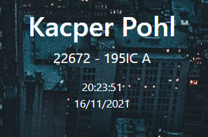
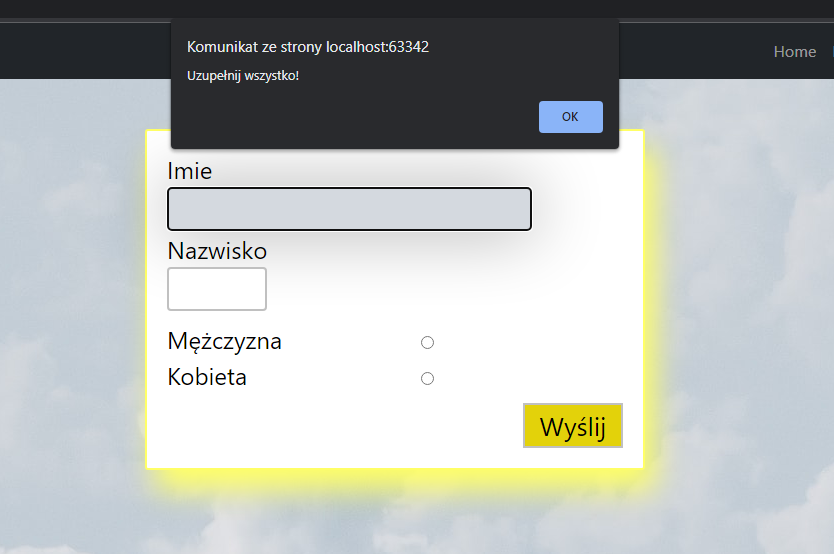
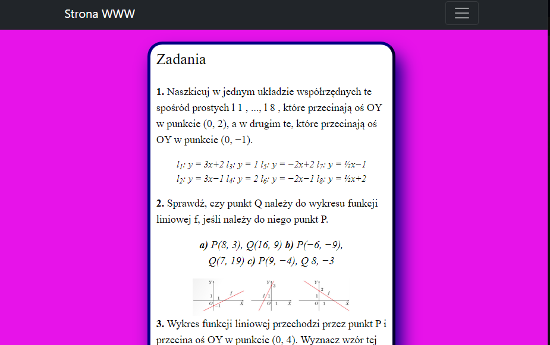
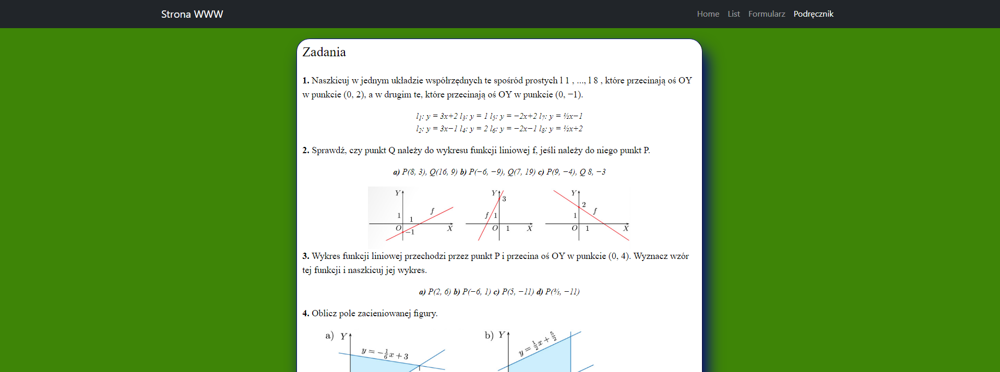

# Lab nr. 3

### Strona startowa - Home (intex.html)

Po naciśnięciu na zegar (addEventListener('click')), pojawi nam się poniżej aktualna data. Zmieniłem także że teraz powiększenie tekstu dotyczącego technologi, działa dzięki addEventListener('mouseover') i zmniejsza do poprzedniego stanu dzięki addEventListener('mouseout').

### Formularz (formularz.html)

Teraz potwierdzenie i wysłanie uzupełnionego formularza działa na addEventListener('submit'), a także po wpisaniu danych, można zatwierdzić wysłanie, za pomocą guzika Enter (addEventListener('keypress')).
Najechanie kursorem na box formularza, zmienia kolor ramki dzięki addEventListener('mouseenter') oraz wraca do porzedniego stanu dzięki addEventListener('mouseleave').

### Podręcznik (podrecznik.html)

Po podwójnym kliknięciu na stronę podręcznika (addEventListener('dblclick')), kolor ramki i cień zmienia kolor. Po użyciu scroll na myszy (addEventListener('wheel')), zmienia się grubość ramki. Gdy zmienimy rozmiar okienka (addEventListener('resize')), kolor tła strony zmieni się na losowy.

