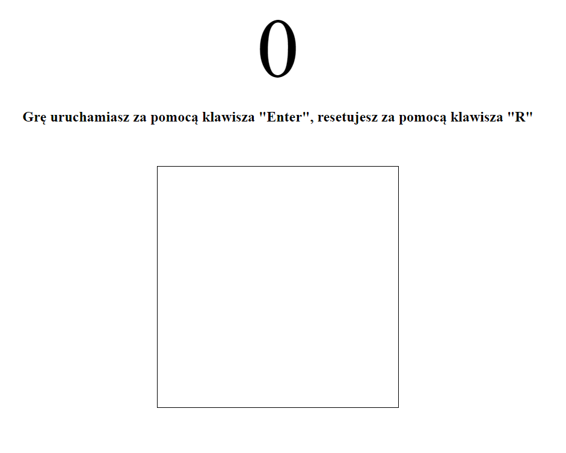
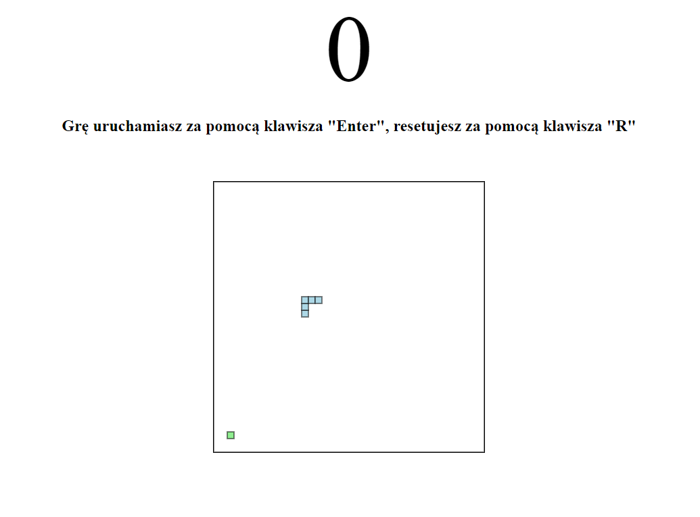
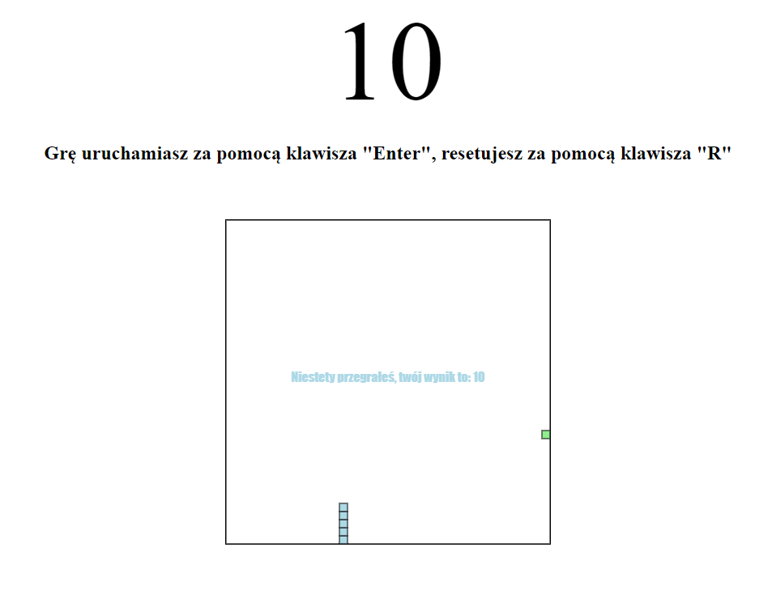

# Lab nr. 4

### Gra 

Gra którą stworzyłem to Snake, polega na zbieraniu "jedzenia", przez co zbiera się punkty, a snake rośnie.
Przy zderzeniu się ze ścianą gra się kończy, wyskakuje informacja w canvasie.
Gra obsługuje klawisze, steruje się strzałkami, grę zaczyna enterem, a resetuje klawieszem R.

