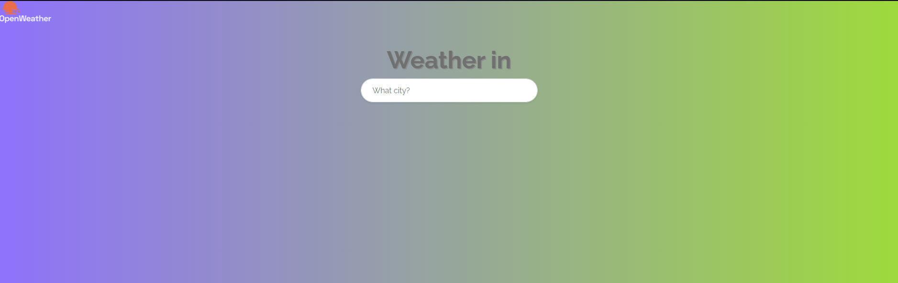
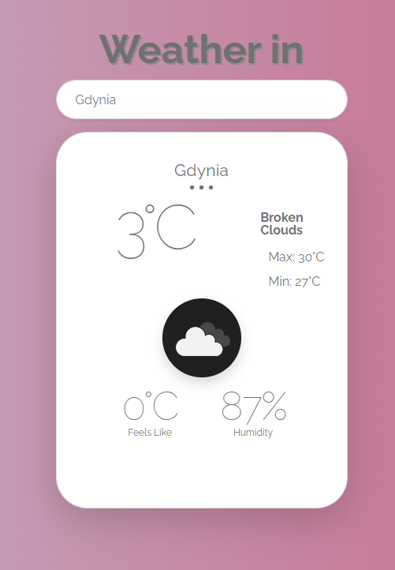
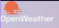
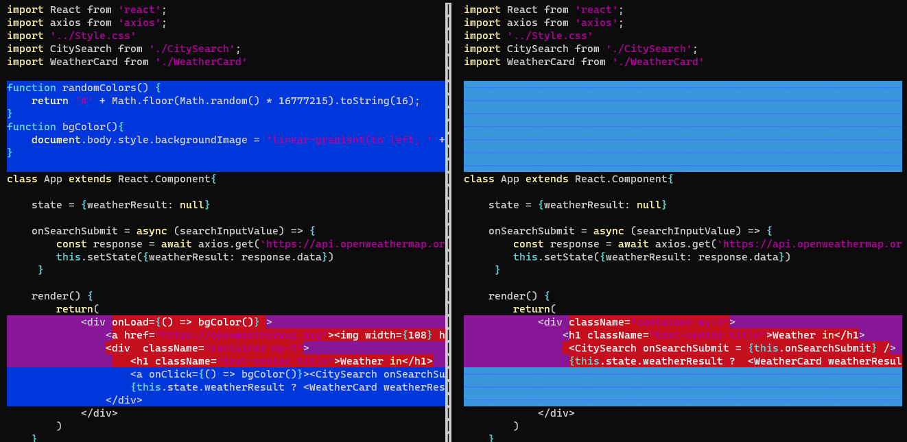
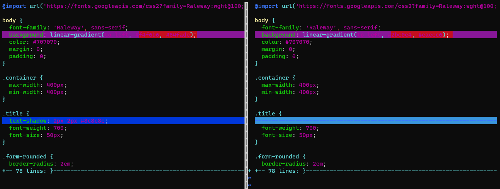

# Lab nr. 8

link do oryginalnej aplikacji - https://github.com/UmutAtes94/React-JS---WeatherAPP

Tak wygląda oryginał

Dodałem w lewym górnym rogu link do strony z której pobierana jest pogoda, oraz po kliknięciu w fragment wyszukiwania miasta, zmieni kolory gradientu na losowy

###git difftool

Polecenie, które umożliwia porównywanie i edycję plików między wersjami przy użyciu typowych narzędzi porównywania.

